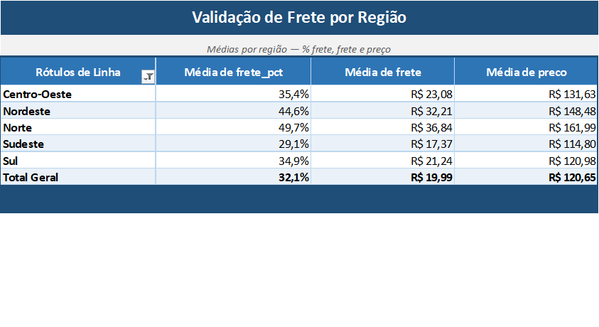

# Análise de Lucratividade no E-commerce Olist

> **Onde a operação da Olist perde valor:** como o atraso na entrega derruba a
> satisfação do cliente, e onde o frete pesa mais na conta por região.
> Tudo medido sobre dado real — sem premissa de custo inventada.

---

## 🎯 Tese

A lucratividade de um marketplace não vaza só pela margem — vaza pela experiência.
Este projeto investiga duas alavancas **medíveis** dessa perda, sobre ~100 mil
pedidos reais da Olist (2016–2018):

- **Tese principal —** o atraso na entrega (e, mais a fundo, o tempo *absoluto*
  de espera) derruba a satisfação do cliente.
- **Camada de apoio —** o peso do frete por região, que corrói a economia do
  pedido justamente onde a distância é maior.

Sem COGS, sem margem estimada: cada número aqui nasce de dado medido. É de
propósito — o projeto se sustenta sem nenhuma premissa de custo inventada.

## 📌 Principais achados

1. **Pontualidade é piso, não diferencial.** A nota média cai de forma contínua —
   de **4,29** (no prazo) para **1,7** (atraso grave, +7 dias). Bastam **1 a 3 dias**
   de atraso para perder ~1 ponto inteiro de avaliação.
   → *E daí:* cada dia de atraso tem custo de reputação mensurável; prazo de
   entrega é alavanca direta de satisfação, não um detalhe operacional.

2. **O prazo prometido folgado esconde a lentidão real.** Norte e Nordeste entregam
   *antes* do prazo e ainda assim têm as piores notas (**4,03** e **3,97**). O que
   derruba não é o atraso — é o tempo absoluto de espera: o Norte espera **22,5 dias**
   contra **10,7** do Sudeste.
   → *E daí:* o problema é estrutural (vendedores concentrados no Sudeste), não um
   atraso pontual. Uma estimativa de prazo folgada mascara o sintoma.

3. **O frete pesa quase o dobro nas regiões mais distantes.** No Norte o frete
   representa **49,7%** do preço médio do item, contra **29,1%** no Sudeste —
   cerca de **1,7x**. As regiões que mais esperam são as que mais pagam frete e
   as menos satisfeitas.
   → *E daí:* tempo, frete e nota andam juntos — correlação forte e consistente,
   sem isolar o frete como causa única.

## ✅ Validação cruzada

Cada número-chave foi recalculado de forma independente no **Excel**, a partir dos
mesmos dados brutos, para confirmar que a query SQL e a planilha chegam ao mesmo
resultado. O peso do frete por região é o exemplo — SQL e Excel batem em todas as
regiões:

> A tabela dinâmica do Excel reproduz os mesmos percentuais, validando a query de
> forma independente.

## 🗂️ Sobre os dados

Dataset público **Brazilian E-Commerce Public Dataset by Olist** — ~100 mil pedidos
reais feitos na Olist Store entre 2016 e 2018, anonimizados. Modelo relacional de
9 tabelas (pedidos, itens, produtos, clientes, vendedores, pagamentos, avaliações,
geolocalização e tradução de categorias).

Fonte: [Kaggle — Brazilian E-Commerce Public Dataset by Olist](https://www.kaggle.com/datasets/olistbr/brazilian-ecommerce).

> ℹ️ Os CSVs originais **não são versionados** (ver `.gitignore`). Para reproduzir,
> baixe-os do Kaggle e siga as instruções abaixo.

## 🛠️ Stack

| Etapa | Ferramenta |
|---|---|
| Armazenamento e carga | PostgreSQL |
| Análise e queries | SQL |
| Validação cruzada | Excel |
| Visualização e storytelling | Power BI |
| Versionamento e documentação | Git + GitHub |

## 📁 Estrutura do repositório

## ▶️ Como reproduzir

1. Baixe os dados do Kaggle (link acima) e coloque os CSVs numa pasta local.
2. Crie o banco no PostgreSQL e rode os scripts de `sql/` na ordem numérica
   (ajuste os caminhos do `02_importacoes.sql` para a sua pasta de CSVs).
3. Rode as queries de `sql/analises/` para reproduzir cada achado.
4. *(em breve)* Abra `powerbi/dashboard.pbix` e aponte a conexão para o seu banco.

---

## 👤 Autor

<!-- TODO: seu nome, LinkedIn e e-mail -->
Lucas Fontes
Projeto de portfólio em Análise de Dados.

